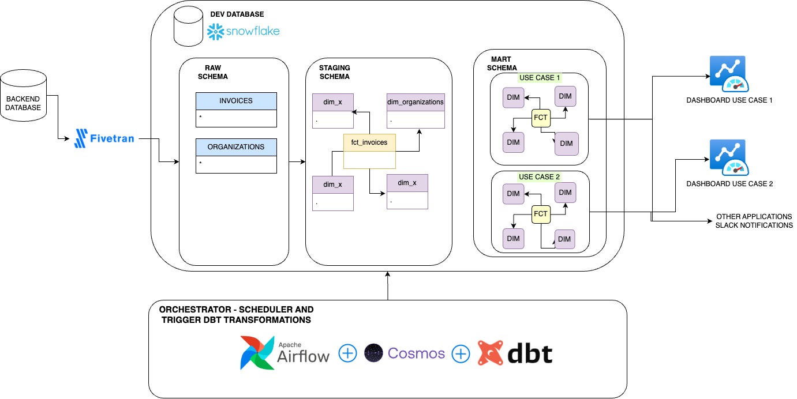

Overview
========

Welcome to Deel Challenge! This repository was written with the purpose of solve Deel task home Challeng

TECH STACK
================

This project will use the following techstack:

- Airflow: To trigger tasks, orchestrate and monitor
- Astro dev cli: Astronomer dev cli to reduce complexity on execute airflow locally
- dbt: To make all the transformations
- cosmos: library created by Astronomer to parse the dbt models in different tasks in Airflow
- slack: For sending alarms

ARCHITECTURE
================

The architecture of this project is the following:



SET UP LOCAL ENVIRONMENT
================

## EXECUTE AIRFLOW LOCALLY

1. Download astro cli

```bash
brew install astro
```
2. Since we will execute airflow using an astronomer image, we need to install Docker. https://docs.docker.com/get-docker/


3. Start astro dev container
```bash
brew install astro
```

4. Create an Airflow Snowflake connection: Go to localhost:8080 (user admin pass admin), then go to connections and add a new connection. In this case for snowflake and fill the following fields:

    - connection_id = snowflake_conn
    - connection_type = Snowflake
    - schema: STAGING
    - Login: {snowflake_username}
    - Password: {snowflake_password}
    - Account: {snowflake_account}
    - Warehouse: compute_wh
    - Database: dev_deel
    - Role: useradmin
    
  4. Create an app in Slack and get slack api token: Go to your slack workspace, your apps, create an app. Then select permissions and grant chat:write and chat:public write. Last, copy the slack api token.


  5. Create an Slack Connection: Next, add a new connection and fill the following fields:

      - connection_id = my_slack_conn
      - connection_type = SLACK API
      - Slack API Token: Copy and Paste slack api token


## EXECUTE DBT LOCALLY

Since we want to execute dbt locally and wihout restarting our container every time that we made a change, here are the instructions on how to execute dbt locally. 

In this case we use pipenv to manage our environments and dependencies.

1. Install pipenv
    ```bash
    pip install pipenv
    ```
2. In terminal on the root folder, activate our environment

   ```bash
    python3 -m pipenv shell
    ```

3. To extend the features of dbt, It's necessary to install some dbt packages:

  ```bash
    pipenv dbt deps 
```

4. Setup the .env file to create some variables that it will be use in the profile yml file

```bash
    user=snowflake_user
    password=snowflake_password
    account=snowflake_account
    DBT_PROJECT_DIR=./dags/dbt
```

SET UP LOCAL ENVIRONMENT
================

A. Please do not share any credential outside .env file. It could be expose in the repository

B. The target folder from dbt was ignore to not expose all the code compile


-----------------------------
That's all :smiley: